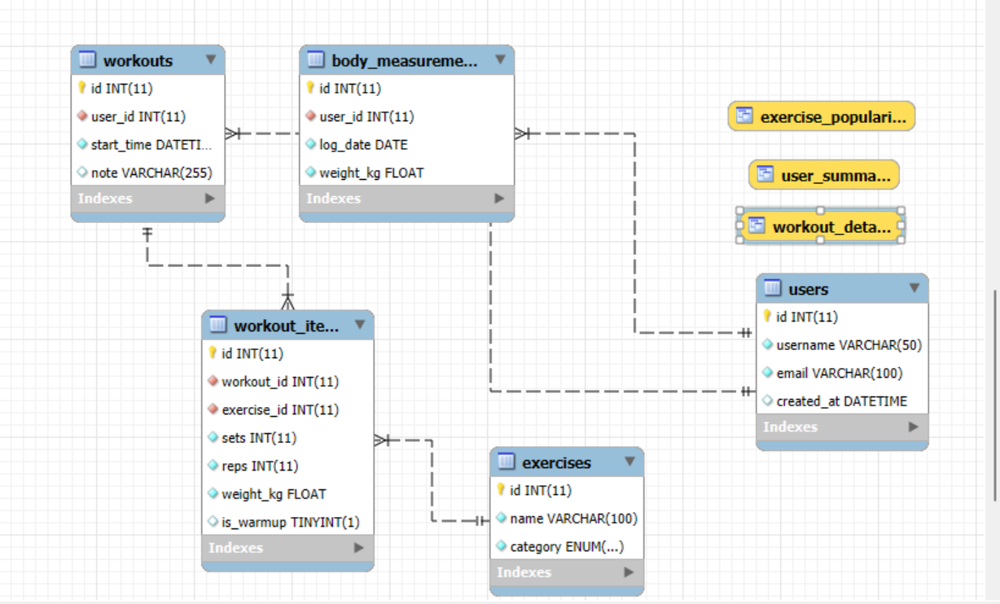
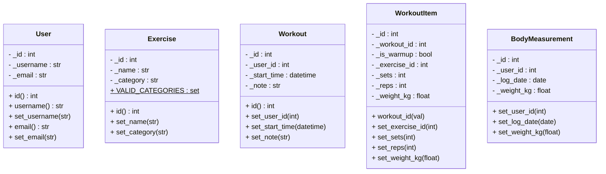

# FitTracker

FitTracker is a comprehensive console-based application designed to help users track their fitness progress. It allows management of exercises, logging of workout sessions, and tracking of body measurements, all backed by a robust database system.

> **Note:** This documentation was created as a school project for SPŠE Ječná.

## How to run it?

* First you need to run the [SQL transaction script](../bin/SQLscript.sql) in the bin folder of your MySQL database
* After the database is created, overwrite the [config.ini](../config/config.ini) file with your login details
* You can then run the project using the .run file or in the development environment using the main class.

## Specifications

* **Python 3.8+**
* **MySQL Server** (Database setup required)
* **Libraries**:
    * `mysql-connector-python` (for database communication)
    * `tkinter` (for file dialogs)
## Features (User Requirements)

* **User Management**: Secure login and registration system.
* **Exercise Database**: View, add, and rename exercises.
* **Workout Tracking**:
    * Create workout sessions with sets, reps, and weights.
    * Distinguish between warm-up and working sets.
    * View detailed history.
* **Data Import**: Bulk import of workout history from CSV files.
* **Body Measurements**: Track weight changes over time.
* **Statistics**: Aggregated user progress reports.

## Architecture & Design Patterns

The project follows strict software engineering principles using **Python** and **MySQL**:

1.  **MVC Architecture**: Separates Model (Entities/Repositories), View (Console output), and Controller (Application logic).
2.  **Repository Pattern**: Abstracts database operations (`UserRepository`, `WorkoutRepository`), keeping domain logic clean.
3.  **Singleton Pattern**: The `DbConnection` class ensures a single shared database connection instance throughout the application lifecycle.
4.  **Command Pattern**: Used to handle user actions and menu navigation.

## Database Model (E-R Diagram)

The application uses a relational database model. The following diagram shows the structure of tables and their relationships.


*(Note: Ensure the image file is named correctly in the project folder)*

## Class Diagram (UML)

The following diagram illustrates the class structure, highlighting the relationship between Entities and Repositories.



## Example of Error Handling Flow
When a user attempts to input invalid data (e.g., creating a user with an invalid email), the system handles it gracefully:

```python
try:
    # Trying to create a user with invalid email
    new_user = User(username="JohnDoe", email="invalid-email")
except ValueError as e:
    # The entity raises ValueError: "Invalid email format: ..."
    raise f"Error: {e}" 
    # The application asks for input again instead of crashing
```

## About project

* **Version**: 1.0
* **Author**: Jan Vavroušek

## About me

* **Contact**: vavrousek@spsejecna.cz
* **School**: SPŠE Ječná